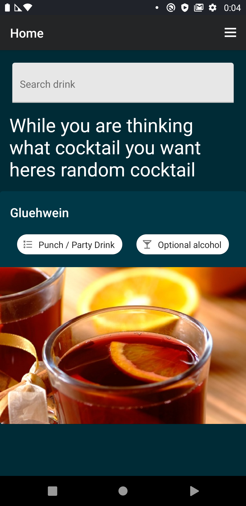
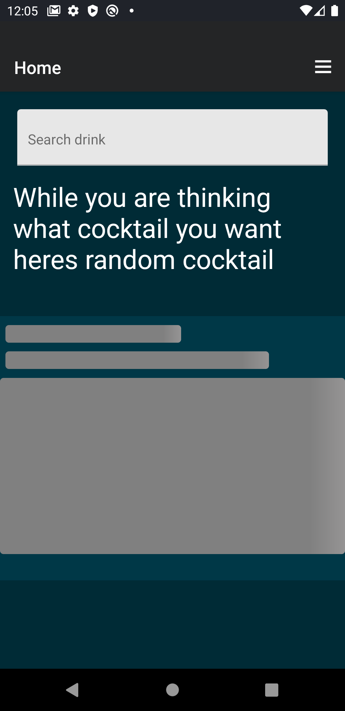
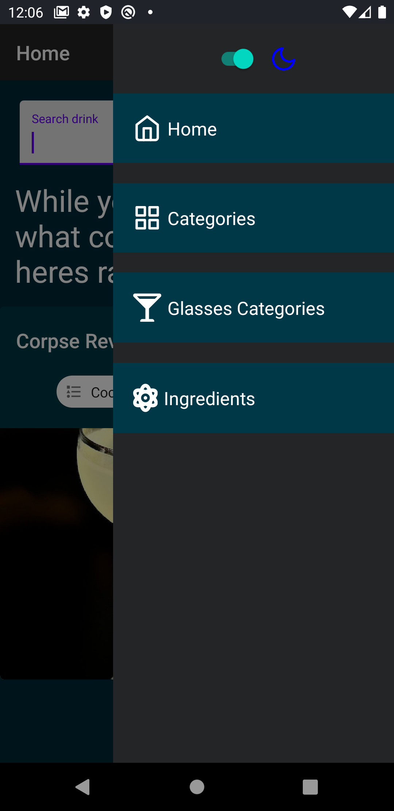
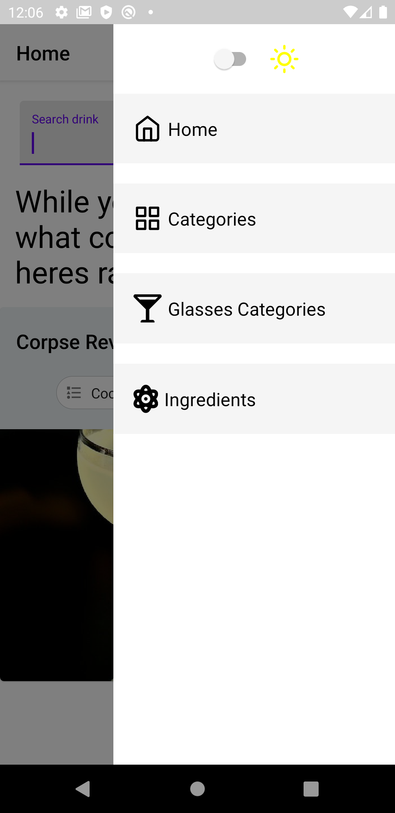
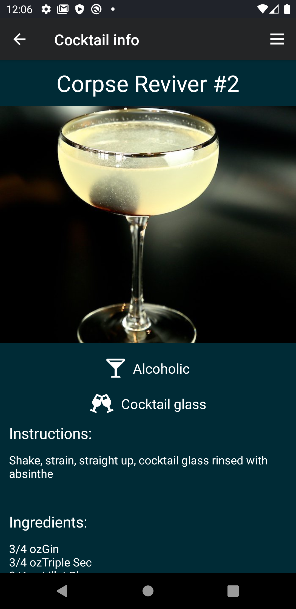
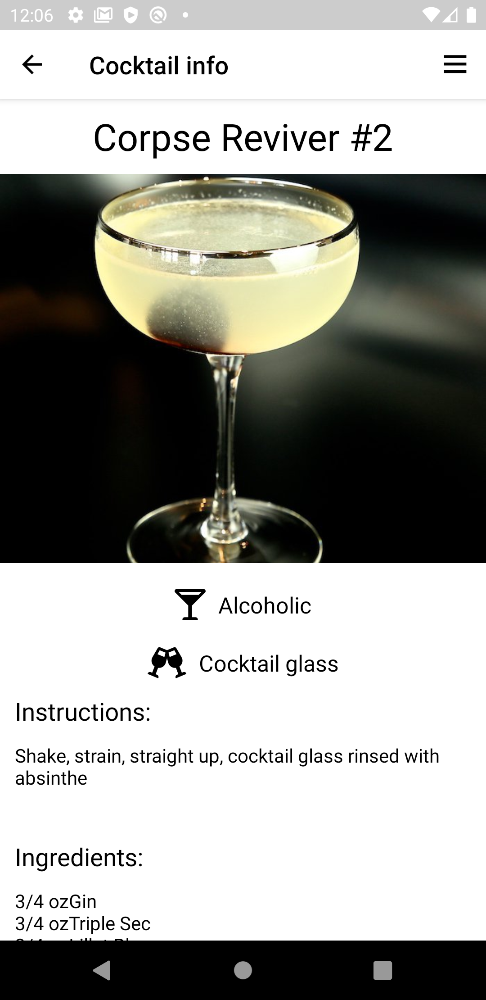

# cocktails app

### In this app you can browse between more than 250 cocktails and get instructions how to create them.

#### The app is written in typescript with github workflow setup to test the app in github actions, [link](https://github.com/ShaharEli/react-native-android-ci-cd) to my guide that will help you setup the ci/cd in your app.

Heres some pics:

